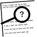

## NAME
   M_display(3f) - a Fortran 95 module for pretty-printing matrices
   (LICENSE:FREE)
<!--
## SYNOPSIS
```text
       use m_display, only : disp
-->
## DESCRIPTION
   A standard Fortran 95 module for printing scalars, vectors, and
   matrices to external files is provided. The module can display
   variables of default kind of all intrinsic types (integer, real,
   complex, logical, and character), and add-on modules are provided
   for data of the nondefault kind. The main module is self-contained
   and incorporating it only requires that it be compiled and linked
   with a program containing a “use M_display” statement. A generic
   interface and optional parameters are used, so that the same subroutine
   name, DISP, is used to display items of different data type and rank,
   irrespective of display options. The subroutine is quite versatile,
   and hopefully can improve Fortran's competitiveness against other
   array programming languages. The module also contains a function
   TOSTRING to convert numerical scalars and vectors to strings.

<!--
## BUILDING THE MODULE USING make(1) 
     git clone https://github.com/urbanjost/M_display.git
     cd M_display/src
     # change Makefile if not using one of the listed compilers
     
     # for gfortran
     make clean
     make F90=gfortran gfortran
     
     # for ifort
     make clean
     make F90=ifort ifort

     # for nvfortran
     make clean
     make F90=nvfortran nvfortran

This will compile the Fortran module and basic example
program that exercise the routine.
-->

## BUILD and TEST with FPM 

   Download the github repository and build it with
   fpm ( as described at [Fortran Package Manager](https://github.com/fortran-lang/fpm) )

   ```bash
        git clone https://github.com/urbanjost/M_display.git
        cd M_display
        fpm run
        fpm run --example
        fpm test
   ```

   or just list it as a dependency in your fpm.toml project file.

```toml
        [dependencies]
        M_display        = { git = "https://github.com/urbanjost/M_display.git" }
```
## DOCUMENTATION

### USER
Note in this version the module "dispmodule" has been named "M_disp" ...

   - [Original report](docs/dispmodule-report.pdf)
   - [Original User Manual](docs/dispmodule-userman-report.pdf)
   - 
     There are man-pages in the repository download in the docs/ directory
     that may be installed on ULS (Unix-Like Systems). 

      + a simple index to the man-pages in HTML form for the
        [routines](https://urbanjost.github.io/M_display/man3.html) 
        and [programs](https://urbanjost.github.io/M_display/man1.html) 
   
      + A single page that uses javascript to combine all the HTML
        descriptions of the man-pages is at 
        [BOOK_M_display](https://urbanjost.github.io/M_display/BOOK_M_display.html).
   
      + [manpages.zip](https://urbanjost.github.io/M_display/manpages.zip)
      + [manpages.tgz](https://urbanjost.github.io/M_display/manpages.tgz)

   - [CHANGELOG](docs/CHANGELOG.md) provides a history of significant changes

### DEVELOPER
   - [ford(1) output](https://urbanjost.github.io/M_display/fpm-ford/index.html).
<!--
   - [doxygen(1) output](https://urbanjost.github.io/M_display/doxygen_out/html/index.html).
-->
   - [github action status](docs/STATUS.md) 
---
## PEDIGREE
Copyright (c) 2008, Kristján Jónasson, Dept. of Computer Science, University of
Iceland (jonasson@hi.is). This software is free. For details see the file LICENSE.

## REFERENCES 

 * [ACM Algorithm 892: DISPMODULE](https://dl.acm.org/doi/10.1145/1486525.1486531) a Fortran 95 module for pretty-printing matrices

```text
   ACM Journals: ACM Transactions on Mathematical Software Vol. 36, No. 1 
   Article No.:  6pp 1–7https://doi.org/10.1145/1486525.1486531
   Author:       Kristjan Jonasson
   Published:    16 March 2009
```
### Additional References sited by the author

  - Chambers, J. M. 2007. Software for Data Analysis: Programming with
    R. Springer-Verlag, New York, NY. Google ScholarDigital Library
  - Eaton, J. W. 2002. GNU Octave Manual. Network Theory Limited, Bristol, U.K.Google Scholar
  - ISO/IEC. 1997. Information technology—programming
    languages—Fortran-part 1: Base language. ISO/IEC Tech. rep. 1539-1:1997. 
    ISO, Geneva, Switzerland.Google Scholar
---
